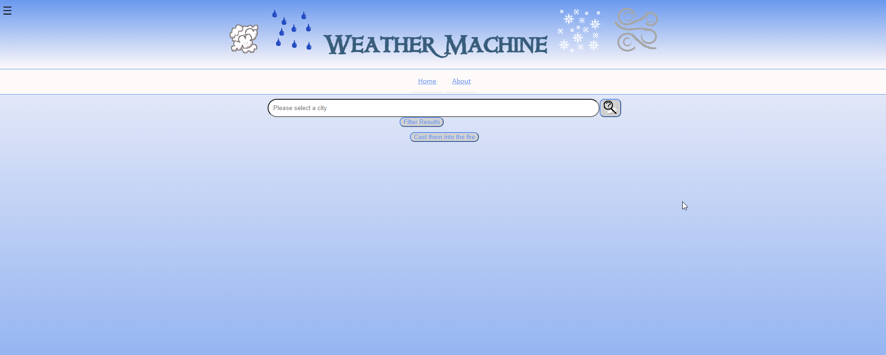
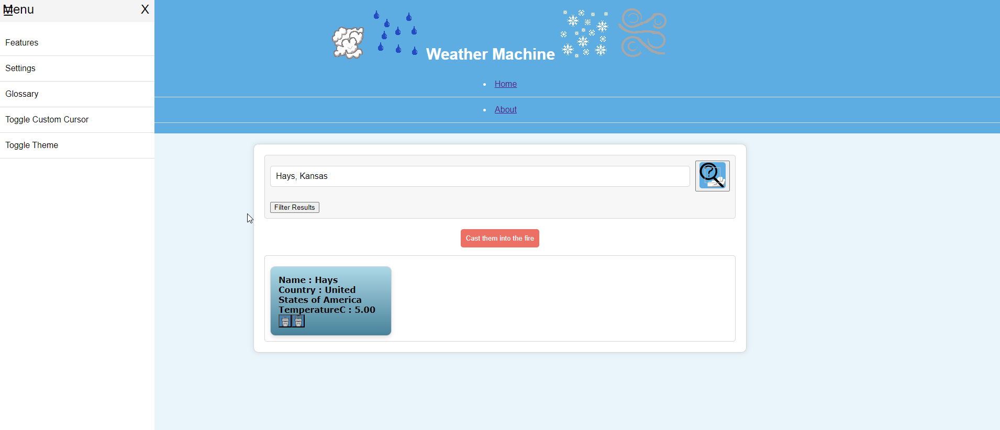

# WeatherMachine

## About the Project

WeatherMachine is a weather application that allows users to fetch and compare weather conditions of multiple cities simultaneously. The app will display the current weather insights and some other information by toggling between simple and detailed views.

## Features

- Dynamic City Search: Fetch weather details for any city
- Compative Analysis: Compare the weather conditions of multiple cities simultaneously
- Versatile Viewing Modes: Switch between a simple or detailed mode. Customize which weather attributes are displayed
- Local Hosting: Currently optimized for local hosting to ensure rapid development and ease of use
- Responsive Design: Fully responsive web design for a seamless experience across various devices (not mobile atm)
- Customization: User preferences are stored using cookies for a personalized experience
- ...

## Built With

- Front-End: HTML, CSS, JavaScript
- API: The app uses [weatherapi](https://www.weatherapi.com/) to fetch real-time weather data.
- Data Storage: Cookies for storing user preferences
- Hosting: Locally hosted for easy setup and rapid development

## Setup and Installation (Getting Started)

To get a local copy up and running, follow the following steps:

1. Clone the repository:
`git clone https://github.com/EtherealManifest/WeatherMachine`

2. Navigate to the project directory:
`cd WeatherMachine`

3. Run the application:
Open `index.html` in your web browser to view the project. (Can use many VSCode extensions) to locally host a live server.

4. Alternatively for Beginners:

- Ensure you have a code editor like VSCode installed
- Clone the repository using the "Clone Repository" option in your editor
- Open the project folder in the editor to view all the files

## Development Roadmap

- [x] Initial setup and project structure
- [x] Implement basic city search functionality
- [x] Display city weather data
- [x] Develop comparative analysis feature of multiple cities
- [x] Implement view modes (simple and detailed) - filters?
- [ ] Introduce cookie-based preference saving
- [ ] Enchance user interface and UX design
- [ ] Weather forecasting feature ?
- [ ] Integration of custom and default weather conditon icons
- [ ] Light/Dark mode implementation ?
- [ ] Classic and Modern Theme
- [ ] Integrate an auto-refresh feature (15 minute)
- [ ] Mobile compatibility and responsive design
- [ ] Localization for multi-language support ?

## Gallery

Here are some screenshots and images that illustrate the features and user interface of WeatherMachine:

